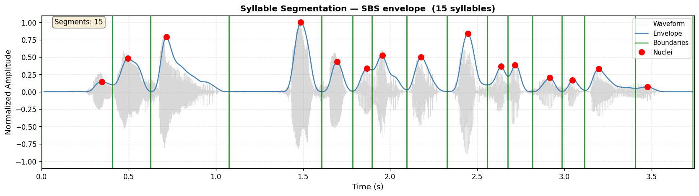
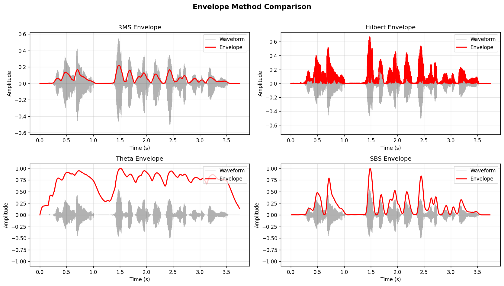
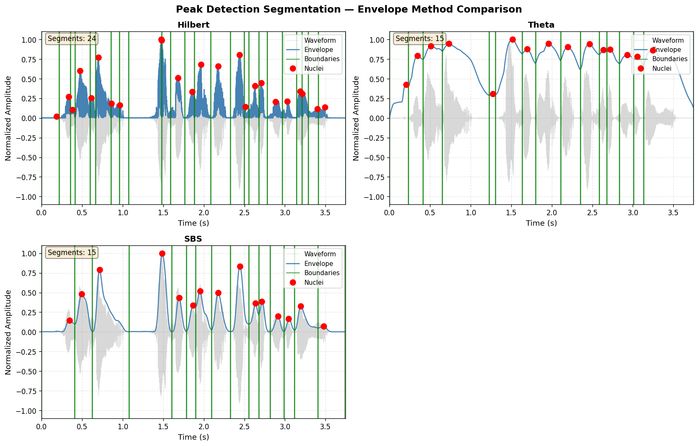
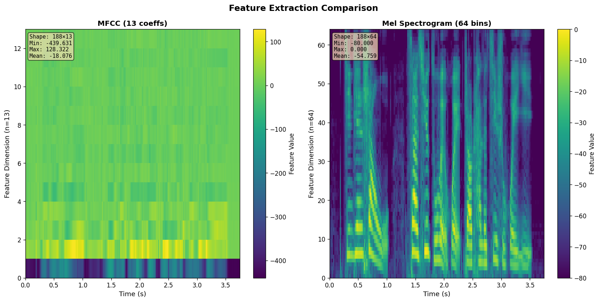

# findsylls

[](https://pypi.org/project/findsylls/)
[](https://pypi.org/project/findsylls/)
[](LICENSE)

Language-agnostic toolkit for unsupervised syllable-level speech segmentation, embedding extraction, and evaluation.

findsylls provides a full pipeline from raw audio to clustered syllable embeddings:

- **Envelope computation** — RMS, Hilbert, low-pass, SBS, theta, and neural pseudo-envelopes
- **Syllable segmentation** — classical peak detection and neural end-to-end methods (Sylber, VG-HuBERT)
- **Feature extraction** — MFCC, mel spectrogram, HuBERT, Sylber, VG-HuBERT
- **Syllable embedding** — pooled per-syllable vectors for downstream tasks
- **Unsupervised discovery** — k-means, mini-batch k-means, agglomerative clustering
- **Evaluation** — F1 against TextGrid annotations at phone, syllable, and word granularity
- **Visualization** — waveform, envelope, segmentation, and feature-matrix plots

---

## Install

```bash
pip install findsylls                  # core (classical methods)
pip install 'findsylls[embedding]'     # neural feature extraction (HuBERT, VG-HuBERT)
pip install 'findsylls[end2end]'       # neural segmenters (Sylber, VG-HuBERT)
pip install 'findsylls[viz]'           # plotting extras
pip install 'findsylls[storage]'       # HDF5 corpus storage
pip install 'findsylls[all]'           # everything
```

---

## Quick Start

### 1 — Segment audio into syllables

```python
from findsylls import segment_audio

# Classical: peak detection on an SBS amplitude envelope
syllables, envelope, times = segment_audio(
    "audio.wav",
    method="peakdetect",
    segmentation_kwargs={"envelope_method": "sbs"},
    return_envelope=True,
)

print(f"Found {len(syllables)} syllables")
# syllables: [(start_s, nucleus_s, end_s), ...]
```



*Waveform (gray), SBS amplitude envelope (blue), syllable boundaries (green), and detected nuclei (red dots) for a sample utterance.*

---

## Module Guide

### Envelope (`findsylls.envelope`)

The envelope module converts a raw audio waveform into a 1-D amplitude signal. All computers implement `EnvelopeComputer.compute(audio, sr) → (envelope, times)`.

```python
from findsylls.audio.utils import load_audio
from findsylls.envelope import (
    RMSEnvelope, HilbertEnvelope, ThetaEnvelope, SBSEnvelope,
    LowpassEnvelope, CLSAttentionEnvelope, GreedyCosineEnvelope,
)
from findsylls.plotting import plot_multiple_envelopes

audio, sr = load_audio("audio.wav")

envelopes = {}
for name, computer in [
    ("RMS",     RMSEnvelope()),
    ("Hilbert", HilbertEnvelope()),
    ("Theta",   ThetaEnvelope()),
    ("SBS",     SBSEnvelope()),
]:
    env, times = computer.compute(audio, sr)
    envelopes[name] = (env, times)

fig = plot_multiple_envelopes(audio, sr, envelopes)
```



*Four classical envelope methods on the same utterance. SBS and Theta track syllabic rhythm most closely; Hilbert and RMS give a more continuous energy contour.*

You can also call the functional dispatch directly:

```python
from findsylls import get_amplitude_envelope

envelope, times = get_amplitude_envelope(audio, sr, method="theta")
```

**Available envelope methods:** `rms`, `hilbert`, `lowpass`, `sbs`, `theta`, `cls_attention`, `greedy_cosine`, `mincut`

---

### Segmentation (`findsylls.segmentation`)

All segmenters return `List[(start_s, nucleus_s, end_s)]`.

#### Classical — peak detection

```python
from findsylls import segment_audio
from findsylls.plotting import plot_multiple_envelope_segmentations
from findsylls.audio.utils import load_audio
from findsylls.envelope import HilbertEnvelope, ThetaEnvelope, SBSEnvelope
from findsylls.segmentation import get_segmenter

audio, sr = load_audio("audio.wav")

results = {}
for name, env_method in [("Hilbert", "hilbert"), ("Theta", "theta"), ("SBS", "sbs")]:
    env_computer = {"hilbert": HilbertEnvelope, "theta": ThetaEnvelope, "sbs": SBSEnvelope}[env_method]()
    env, times = env_computer.compute(audio, sr)
    segmenter = get_segmenter("peakdetect", envelope_method=env_method)
    segments = segmenter.segment(audio=audio, sr=sr)
    results[name] = (env, times, segments)

fig = plot_multiple_envelope_segmentations(audio, sr, results)
```



*The same audio segmented by `peakdetect` using three different envelope methods. Each panel shows how the chosen envelope shape influences where boundaries fall.*

#### Neural — preset segmenters (`findsylls[end2end]`)

Preset classes replicate the exact configurations from published papers:

```python
from findsylls.segmentation.presets import (
    SylberSegmenter,          # Park et al. 2024 — greedy cosine on Sylber HuBERT
    VGHubertMinCutSegmenter,  # Peng et al. 2023 — SSM MinCut on VG-HuBERT
    VGHubertCLSSegmenter,     # Peng & Harwath 2022 — CLS attention on VG-HuBERT
)
from findsylls.audio.utils import load_audio

audio, sr = load_audio("audio.wav")

# Sylber (default paper config)
sylber = SylberSegmenter()
syllables = sylber.segment(audio, sr=sr)
print(f"Sylber: {len(syllables)} syllables")

# VG-HuBERT MinCut (syllable mode, layer 8)
vgh_mincut = VGHubertMinCutSegmenter(mode="syllable")
syllables = vgh_mincut.segment(audio, sr=sr)

# VG-HuBERT CLS attention (word mode, layer 9)
vgh_cls = VGHubertCLSSegmenter(mode="word")
words = vgh_cls.segment(audio, sr=sr)
```

#### Generic dispatch

```python
from findsylls.segmentation import get_segmenter, list_segmenters

print(list_segmenters())
# ['peakdetect', 'cls_attention', 'mincut', 'greedy_cosine']

segmenter = get_segmenter("mincut")
syllables = segmenter.segment(audio, sr=sr)
```

---

### Feature Extraction (`findsylls.features`)

Feature extractors implement `FeatureExtractor.extract(audio, sr) → np.ndarray` (shape: `[T, D]`).

```python
from findsylls.audio.utils import load_audio
from findsylls.features import MFCCExtractor, MelSpectrogramExtractor, HuBERTExtractor
from findsylls.plotting import plot_multiple_feature_matrices
import numpy as np

audio, sr = load_audio("audio.wav")

mfcc    = MFCCExtractor(n_mfcc=13)
melspec = MelSpectrogramExtractor(n_mels=64)

mfcc_feat = mfcc.extract(audio, sr)
mel_feat  = melspec.extract(audio, sr)

feature_results = {
    "MFCC (13 coeffs)":        (mfcc_feat,  np.linspace(0, len(audio)/sr, mfcc_feat.shape[0])),
    "Mel Spectrogram (64 bins)": (mel_feat, np.linspace(0, len(audio)/sr, mel_feat.shape[0])),
}

fig = plot_multiple_feature_matrices(audio, sr, feature_results)
```



*MFCC and mel spectrogram feature matrices for the same utterance. Color encodes feature value; brighter = higher activation.*

**Available extractors:** `mfcc`, `melspectrogram`, `hubert`, `sylber`, `vghubert`

```python
from findsylls.features import get_extractor

extractor = get_extractor("hubert")          # vanilla HuBERT base (layer 9)
features  = extractor.extract(audio, sr)     # shape: [T, 768]
```

---

### Embedding (`findsylls.embedding`)

Embedding wraps feature extraction + segmentation + pooling into a single call.

#### Single file

```python
from findsylls import embed_audio

embeddings, metadata = embed_audio(
    "audio.wav",
    segmentation="peakdetect",
    features="mfcc",
    pooling="mean",                          # mean | max | median | onc
    segmentation_kwargs={"envelope_method": "hilbert"},
    return_metadata=True,
)

print(embeddings.shape)                      # (n_syllables, 13)
print(metadata["num_syllables"])
print(metadata["boundaries"])                # [(start, end), ...]
```

#### Corpus

```python
from findsylls import embed_corpus, save_embeddings

results = embed_corpus(
    audio_files=["a.wav", "b.wav", "c.wav"],
    segmentation="peakdetect",
    features="mfcc",
    pooling="mean",
    segmentation_kwargs={"envelope_method": "hilbert"},
    n_jobs=4,
)

save_embeddings(results, "embeddings.npz")
```

#### Storage-backed corpus (large datasets)

For datasets that don't fit in RAM, write embeddings directly to disk:

```python
from findsylls.embedding import embed_corpus_to_storage

bundle = embed_corpus_to_storage(
    audio_files=["a.wav", "b.wav", ...],
    output_dir="./embeddings",
    segmentation="peakdetect",
    features="mfcc",
    pooling="mean",
    segmentation_kwargs={"envelope_method": "hilbert"},
)

print(f"Embedded {bundle['num_success']}/{bundle['num_files']} files")
# Writes: ./embeddings/embedding_manifest.csv + ./embeddings/000000_*.npz
```

#### Preset-based embedding

```python
from findsylls.embedding import EmbeddingPipeline

pipeline = EmbeddingPipeline(preset="sylber", pooling="mean")
embeddings, metadata = pipeline.embed_audio("audio.wav", return_metadata=True)
```

**Available pooling methods:** `mean`, `max`, `median`, `onc`

---

### Discovery (`findsylls.discovery`)

Discovery clusters syllable embeddings into unsupervised categories.

```python
from findsylls import embed_corpus, save_embeddings
from findsylls.discovery import DiscoveryPipeline
import numpy as np

# Embed a corpus
results = embed_corpus(audio_files=["a.wav", "b.wav", "c.wav"],
                       segmentation="peakdetect", features="mfcc", pooling="mean",
                       segmentation_kwargs={"envelope_method": "hilbert"})
embeddings = np.vstack([r["embeddings"] for r in results if r.get("success")])

# Cluster
pipeline = DiscoveryPipeline(method="kmeans", model_kwargs={"n_clusters": 50})
result   = pipeline.discover(embeddings)

print(result.labels)                          # cluster assignment per syllable
print(result.fit_metrics["silhouette"])
print(result.fit_metrics["davies_bouldin"])
```

#### Streaming clustering (corpus too large for RAM)

```python
from findsylls.embedding import embed_corpus_to_storage
from findsylls.discovery import DiscoveryPipeline

bundle = embed_corpus_to_storage(audio_files=[...], output_dir="./embeddings",
                                  segmentation="peakdetect", features="mfcc", pooling="mean",
                                  segmentation_kwargs={"envelope_method": "hilbert"})

pipeline = DiscoveryPipeline(method="minibatch_kmeans", model_kwargs={"n_clusters": 50})
result   = pipeline.discover_from_storage(manifest_path=bundle["manifest_path"])
```

**Memory comparison:**

| Approach | ~500K syllables × 768-D |
|---|---|
| `embed_corpus` + `vstack` + `KMeans` | ~10 GB RAM |
| `embed_corpus_to_storage` + `discover_from_storage` | ~500 MB RAM |

**Available methods:** `kmeans`, `minibatch_kmeans`, `agglomerative`

---

### Full Corpus Workflow (`findsylls.pipeline`)

`FindSyllsOrchestrator` and `discover_corpus` run the entire pipeline — embed, discover, build manifests — in one call:

```python
from findsylls import discover_corpus

result = discover_corpus(
    audio_files="data/**/*.wav",
    output_dir="./output",
    segmentation_method="peakdetect",
    features_method="mfcc",
    pooling_method="mean",
    discovery_method="kmeans",
    segmentation_kwargs={"envelope_method": "hilbert"},
)

print(result["corpus_manifest"])             # joined DataFrame
print(result["discovery_manifest_path"])
print(result["discovery_metrics"])
```

Or use the class directly:

```python
from findsylls.pipeline.orchestrator import FindSyllsOrchestrator

orch = FindSyllsOrchestrator()

# Single file: segment + embed
embeddings, metadata = orch.segment_and_embed_audio(
    "audio.wav",
    segmentation_method="peakdetect",
    features_method="mfcc",
    pooling_method="mean",
    segmentation_kwargs={"envelope_method": "hilbert"},
)
```

---

### Evaluation (`findsylls.evaluation`)

#### Evaluate segmentation against TextGrid annotations

```python
from findsylls import segment_audio, evaluate_segmentation

syllables, _, _ = segment_audio(
    "audio.wav",
    method="peakdetect",
    segmentation_kwargs={"envelope_method": "hilbert"},
)

peaks = [nucleus for _, nucleus, _ in syllables]
spans = [(start, end) for start, _, end in syllables]

metrics = evaluate_segmentation(
    peaks=peaks,
    spans=spans,
    textgrid_path="annotations.TextGrid",
    tiers={"phone": 2, "syllable": 1, "word": 0},
)

# Keys: nuclei, syllable_boundaries, syllable_spans, word_boundaries, word_spans
print(metrics["syllable_boundaries"])
# {'TP': 12, 'Ins': 2, 'Del': 1, 'Sub': 0, 'Precision': ..., 'Recall': ..., 'F1': ...}
```

#### Batch evaluation over a corpus

```python
from findsylls import run_evaluation

df = run_evaluation(
    textgrid_paths="data/**/*.TextGrid",
    wav_paths="data/**/*.wav",
    tiers={"phone": 2, "syllable": 1, "word": 0},
    method="peakdetect",
    segmentation_kwargs={"envelope_method": "hilbert"},
)

print(df.groupby("method")[["syllable_boundaries_f1", "word_spans_f1"]].mean())
```

#### Discovery label metrics

Connect cluster assignments to ground-truth TextGrid labels:

```python
from findsylls.evaluation import (
    attach_textgrid_labels_to_manifest,
    compute_discovery_label_metrics,
)

labeled = attach_textgrid_labels_to_manifest(
    manifest=corpus_manifest,
    file_manifest=file_manifest_df,
    wav_paths=["a.wav", "b.wav"],
    textgrid_paths=["a.TextGrid", "b.TextGrid"],
    textgrid_tier_index=2,                       # phone tier
)

metrics = compute_discovery_label_metrics(labeled)
print(f"Cluster purity:  {metrics['cluster_purity']:.3f}")
print(f"Label purity:    {metrics['label_purity']:.3f}")
print(f"Normalized MI:   {metrics['label_norm_mutual_info']:.3f}")
print(f"Macro F1:        {metrics['macro_f1']:.3f}")
```

#### Visualize evaluation results

```python
from findsylls import plot_segmentation_result

# df = output of run_evaluation(), file_id = stem of the audio file
fig, ax = plot_segmentation_result(
    df,
    file_id="SP20_117",
    envelope_fn="sbs",
    syll_tier=1,
    phone_tier=2,
    word_tier=0,
)
```

---

### Preset System (`findsylls.presets`)

Named presets bundle segmentation + feature + pooling configurations from published papers:

```python
from findsylls import get_preset, resolve_preset, list_presets

print(list_presets())
# ['sylber', 'vg_hubert_mincut', 'vg_hubert_cls', 'syllablelm']

cfg = get_preset("sylber")
# {'segmentation': 'greedy_cosine', 'features': 'sylber', 'pooling': 'mean', ...}

# Merge a preset with user overrides
cfg = resolve_preset("sylber", pooling="onc")

# Use directly with EmbeddingPipeline
from findsylls.embedding import EmbeddingPipeline
pipeline = EmbeddingPipeline(preset="sylber", pooling="mean")
```

---

## CLI

```bash
# Segment audio into syllable boundaries
findsylls segment audio.wav --envelope hilbert --method peakdetect --out syllables.json

# Batch evaluation against TextGrid annotations
findsylls evaluate "data/**/*.wav" "data/**/*.TextGrid" \
  --phone-tier 2 --syllable-tier 1 --word-tier 0 \
  --envelope hilbert --method peakdetect \
  --out results.csv --aggregate summary.csv
```

---

## Methods Reference

### Envelope methods
`rms` · `hilbert` · `lowpass` · `sbs` · `theta` · `cls_attention` · `greedy_cosine` · `mincut`

### Segmentation methods (dispatch strings)
`peakdetect` · `cls_attention` · `mincut` · `greedy_cosine`

### Preset segmenters (paper-replication classes)
`SylberSegmenter` · `VGHubertMinCutSegmenter` · `VGHubertCLSSegmenter`

### Feature extractors
`mfcc` · `melspectrogram` · `hubert` · `sylber` · `vghubert`

### Pooling methods
`mean` · `max` · `median` · `onc`

### Discovery methods
`kmeans` · `minibatch_kmeans` · `agglomerative`

---

## Citation

```bibtex
@misc{martinez2026findsyllslanguageagnostictoolkitsyllablelevel,
  title={findsylls: A Language-Agnostic Toolkit for Syllable-Level Speech Tokenization and Embedding},
  author={Héctor Javier Vázquez Martínez},
  year={2026},
  eprint={2603.26292},
  archivePrefix={arXiv},
  primaryClass={cs.CL},
  url={https://arxiv.org/abs/2603.26292},
}
```

## License

MIT. See [LICENSE](LICENSE).
